# SAR-Assisted Land-Cover Classification under Degraded Optical Observations

A take-home case study investigating whether Sentinel-1 SAR imagery improves land-cover
classification when Sentinel-2 optical observations are partially unavailable (e.g. cloud
cover), using a manageable subset of BigEarthNet v2.0.

> Full requirements extraction: [REQUIREMENTS.md](REQUIREMENTS.md). Full data-access research
> and the subset-selection rationale: [DATA_ACCESS.md](DATA_ACCESS.md). This README is the
> top-level narrative; those two files carry the detailed research trail.

---

## TL;DR

- **Question:** does SAR help land-cover classification when optical is cloud-degraded? **Yes,
  under heavy degradation** — at 75% simulated cloud coverage, the SAR-assisted model beats
  optical-only by ~28% relative macro-F1 (0.51 vs. 0.40, corrected metric, round 2). At 0–25%
  coverage the two are roughly comparable once the optical-only baseline is properly
  class-weighted (§7.3) — SAR's advantage is concentrated at high degradation, not universal.
- **Two rounds, on purpose:** round 1 (§5–6) is the direct, straightforward answer. Round 2 (§7)
  went back and found a real bug in round 1's evaluation metric (3 of 19 classes had zero
  train/test examples in this subset, silently penalizing every model equally), fixed it, added
  class-balanced loss, and tested two more SAR-fusion variants. **The round-2 correction changed
  where the SAR-crossover point sits, not whether SAR helps** — that revision is reported openly
  rather than smoothed over.
- **What surprised us:** a more complex two-branch fusion architecture didn't beat simple
  channel-concatenation (§7.3) — direct support for the case's "doesn't need to be
  sophisticated" premise. A model trained at one fixed 50% cloud coverage generalized better
  across 0–75% than one trained on randomized coverage (§7.3).
- **Biggest caveat:** every number here is a **single run, no seeds/confidence intervals**
  (§8, item 2) — the safest thing to challenge in this submission, and worth reading before
  trusting small gaps between numbers to two decimal places.
- **Where to look:** §5 for round-1 setup/results, §7 for the round-2 corrections and deeper
  ablations, §7.5 for class-confusion analysis, §8 for open limitations.

---

## 1. Problem understanding

Optical satellite imagery (Sentinel-2) is intuitive but frequently obscured by clouds. SAR
imagery (Sentinel-1, C-band) penetrates cloud cover and is illumination-independent, so it can
supply information when optical observations are missing. The question this case asks is narrow
and concrete: **does adding SAR to a degraded (cloud-masked) optical input improve land-cover
classification relative to using the degraded optical image alone?**

Three conditions are compared:

- **A — Optical only (clean):** Sentinel-2, no degradation. Establishes the ceiling.
- **B — Degraded optical:** the same optical-only model, evaluated after artificially masking
  part of the Sentinel-2 image (simulated cloud occlusion), at several coverage levels.
- **C — Degraded optical + SAR:** a SAR-assisted model, given the *same* degraded optical image
  as B plus the paired Sentinel-1 observation.

The primary comparison the case asks for is **B vs. C**, broken down by cloud-coverage severity;
A is the reference ceiling. This is treated as a **multi-label** classification problem
(BigEarthNet's native 19-class scheme — a single patch can carry several land-cover labels), not
segmentation or detection.

## 2. Dataset and subset construction

**Source:** BigEarthNet v2.0 ("reBEN"), the paired Sentinel-1/Sentinel-2 archive on Zenodo
(record 10891137) — 549,488 patch pairs, 19 official CORINE-derived land-cover classes,
geographically-decorrelated official train/val/test split. Full research trail (why v2.0, what
alternatives were checked and ruled out, exact archive internals) is in
[DATA_ACCESS.md](DATA_ACCESS.md).

**Why a subset, and how it was chosen** (the PDF explicitly asks for this — "you do not need to
use the complete dataset"): the only official distribution is two monolithic ~54–63 GB
`.tar.zst` archives (single, non-seekable zstd frames — confirmed by direct inspection), so there
is no official way to fetch a class- or tile-based slice directly. The approach taken:

1. Downloaded only the two metadata parquet files (~4.3 MB) and filtered/joined them **entirely
   offline** — this alone resolves class list, official splits, and S1↔S2 pairing (a lossless
   1:1 `s1_name` lookup, verified with zero nulls/duplicates across all 549,488 rows) before
   touching any imagery.
2. Selected the **5 alphabetically-earliest Sentinel-2 products** in archive order (Austria,
   Finland ×2, Ireland, Portugal) — cheap to stream since the S2 archive is itself alphabetically
   ordered — yielding 34,190 patches that already cover **19/19 classes**.
3. Kept only patches whose paired Sentinel-1 scene is an **S1A**-mission product (S1 archive
   order is split into a contiguous S1A block then S1B block; restricting to S1A cuts the needed
   S1 stream from ~35 GB down to ~1.4 GB while still preserving all 19 classes and all 3 splits)
   → **13,932 candidate paired patches**.
4. From that candidate pool, drew a **stratified sample of 4,200 patches** (proportional to the
   official train/val/test split sizes, with a rarest-label-first allocation so minority classes
   like "Beaches, dunes, sands" keep representation) — sized to train comfortably on CPU-only
   hardware within the exercise's time budget.
5. Streamed only the required byte ranges of both `.tar.zst` archives from byte 0, writing just
   the matching per-patch GeoTIFFs to disk and aborting the connection once past the last needed
   product — **~5.6 GB total transferred, vs. 118 GB for both full archives.**

**Caveat disclosed openly:** restricting to S1A-paired patches is a convenience constraint for
this exercise's compute/bandwidth budget, not a scientific one — it slightly biases the sample
toward whichever sub-area of each tile happened to be nearer an S1A overpass. This is a
reasonable trade-off at this scale but is not claimed to be a representative geographic sample.

Final counts: **4,200 patches** (train 2,040 / val 1,097 / test 1,063), all **19 official
classes** present.

## 3. Simulated cloud masking (condition B / C degradation)

The PDF leaves the exact masking mechanism unspecified. Implementation used here: 1–3 randomly
placed, randomly sized rectangular occlusions per patch, combined area tuned to hit a target
coverage fraction, applied identically across all 12 optical bands (spatial, not per-band), with
masked pixels replaced by that band's mean over the *unmasked* region (a neutral "no information"
fill rather than zero, which would otherwise read as a real, informative extreme reflectance
value). Coverage levels evaluated: **0%, 25%, 50%, 75%**. This is a simplification of true cloud
shape/texture, chosen for speed and reproducibility — documented as a design choice, not claimed
as realistic cloud simulation.

## 4. Models

**Minimum baseline (conditions A & B):** a small CNN trained from scratch on clean Sentinel-2
(12 bands, resized to 120×120), then the *same trained model* re-evaluated on masked inputs at
each coverage level — exactly the "train once, evaluate under degradation" recipe the PDF
specifies as the floor.

**SAR-assisted contribution (condition C):** the same CNN backbone, extended to 14 input channels
via **early concatenation of the (degraded) optical bands with the 2 SAR bands (VV, VH)** — the
simplest of the four fusion patterns the PDF lists as acceptable examples ("does not need to be
sophisticated"). Trained with **randomly sampled mask coverage per sample (0–75%)** during
training so the model learns to lean on SAR when optical is degraded, then evaluated at the same
fixed coverage levels as B, on the *same masked realization per test patch*, for a fair
per-sample-matched comparison.

Both models: 4 conv blocks (32→64→128→256 channels, BatchNorm, ReLU, 2×2 maxpool) → global
average pool → dropout → linear classifier, BCEWithLogitsLoss (multi-label), Adam + cosine LR
schedule, 8 epochs, batch size 32, CPU-only. No hyperparameter sweep was performed, per the case's
explicit instruction not to spend substantial time tuning.

## 5. Evaluation

Multi-label metrics reported: **macro-F1** (primary, since classes are imbalanced — "Beaches,
dunes, sands" has ~90x fewer patches than "Mixed forest" even before subsetting), **micro-F1**,
per-label ("Hamming") accuracy, exact-match accuracy, and mean predictive entropy of the sigmoid
outputs as a simple uncertainty proxy. Results are broken down by condition (A/B/C) and by cloud
coverage level (0/25/50/75%), per the case's explicit ask.

### Results

> **This is the round-1 baseline** (unweighted loss, naive 19-class macro F1, one fusion
> architecture). §7 (Round 2) found and fixed a real metric-validity issue in these numbers and
> adds class-balanced loss, two more SAR-fusion variants, and calibration analysis — read this
> section for the initial finding, then §7 for the corrected/deeper picture. The qualitative
> conclusion (SAR helps under heavy degradation) holds in both; the quantitative crossover point
> shifts once the baseline is strengthened (§7.3).

All numbers are on the held-out **test split** (1,063 patches), 8 training epochs, no
hyperparameter tuning. Full table: [outputs/metrics/results.csv](outputs/metrics/results.csv).

| Condition | Cloud coverage | Macro F1 | Micro F1 | Hamming acc. | Mean entropy |
|---|---:|---:|---:|---:|---:|
| **A** — optical only, clean | 0% | **0.407** | 0.618 | 0.896 | 0.245 |
| C (SAR) at 0% coverage | 0% | 0.389 | 0.602 | 0.893 | 0.255 |
| **B** — degraded optical only | 25% | 0.333 | 0.564 | 0.892 | 0.241 |
| **C** — degraded optical + SAR | 25% | **0.384** | 0.605 | 0.892 | 0.254 |
| **B** — degraded optical only | 50% | 0.240 | 0.497 | 0.882 | 0.239 |
| **C** — degraded optical + SAR | 50% | **0.386** | 0.604 | 0.890 | 0.260 |
| **B** — degraded optical only | 75% | 0.207 | 0.468 | 0.872 | 0.239 |
| **C** — degraded optical + SAR | 75% | **0.385** | 0.598 | 0.887 | 0.265 |

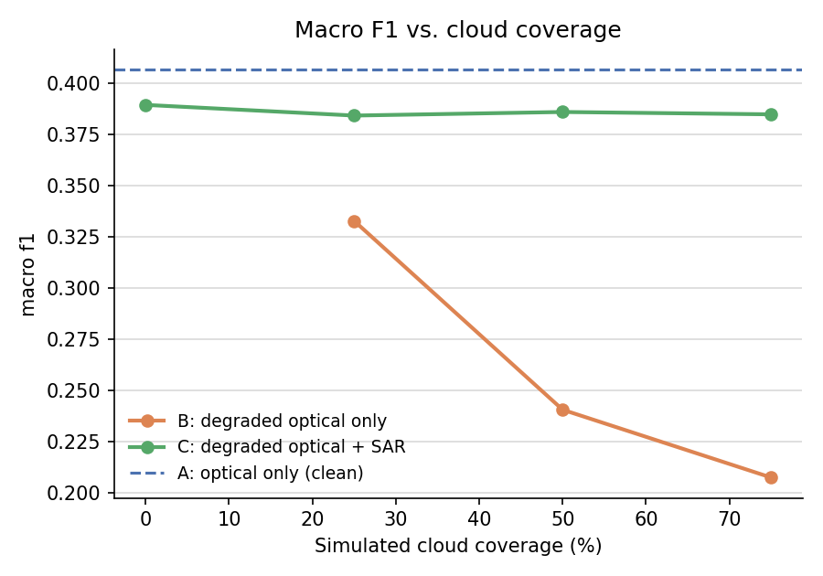

**Headline finding:** as simulated cloud coverage increases, the optical-only model (B) collapses
— macro F1 drops **49%** from clean (0.41) to 75% coverage (0.21). The SAR-assisted model (C) is
almost flat across the same range (0.389 → 0.385, a **~1% relative drop**), and at 50–75% coverage
it roughly **1.6–1.9x's** B's macro F1. This is the expected result and matches the case's stated
motivation directly: SAR supplies the land-cover signal optical can no longer see once enough of
the scene is occluded. The gap is small at 0–25% coverage (there's still enough optical signal for
B to work reasonably) and widens sharply beyond 50%, where B's failure becomes severe.

One honest asymmetry: **at 0% coverage, A/B's own clean-optical model (0.407) still edges out C
(0.389)** — model C is trained with random mask augmentation (0–75%) and never sees purely-clean
inputs at full weight, plus it must learn to weight a second modality, both of which cost a little
accuracy when there is no degradation to compensate for. This is a reasonable and expected
trade-off, not a bug: C is optimized for robustness under degradation, not peak clean-data
accuracy, and the case's primary ask (B vs. C **under degradation**) is exactly where that
trade-off pays off.

Hamming (per-label) accuracy tells a much less dramatic story (0.896 → 0.872 for B, barely moving
for C) — this metric is inflated by label sparsity (most of the 19 labels are correctly predicted
"absent" for any given patch, which is easy), which is exactly why **macro F1 is used as the
primary metric here**: it weights all 19 classes equally regardless of frequency and is far more
sensitive to the real degradation in usable signal.

### Per-class breakdown

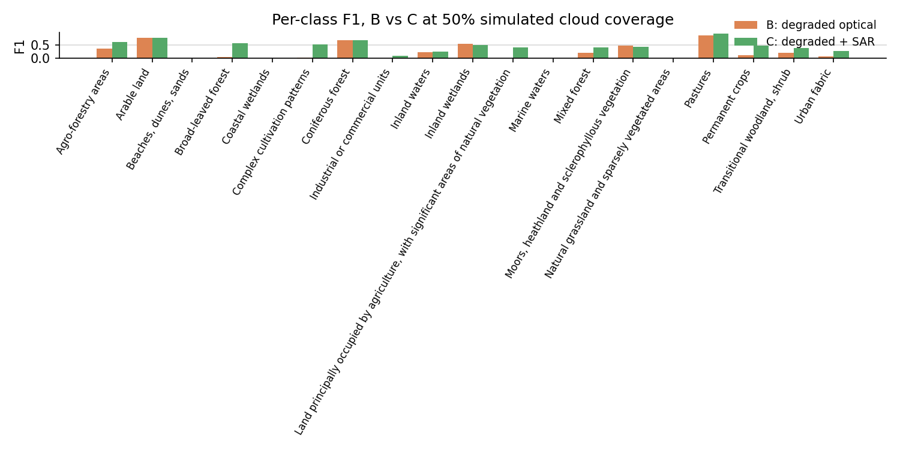

At 50% coverage, condition C matches or beats condition B on essentially every class with
non-trivial support (Arable land, Broad-leaved/Coniferous/Mixed forest, Pastures, Inland
wetlands/waters, Complex cultivation patterns). Several rare classes in this subset — "Beaches,
dunes, sands", "Coastal wetlands", "Marine waters", "Natural grassland and sparsely vegetated
areas", "Industrial or commercial units" — score **zero F1 for both B and C**. This is a direct
consequence of the small, class-imbalanced 4,200-patch subset and the 8-epoch, no-tuning training
budget (per the case's explicit instruction not to spend time tuning) rather than a SAR-specific
failure — see §6.

### Qualitative successes and failures

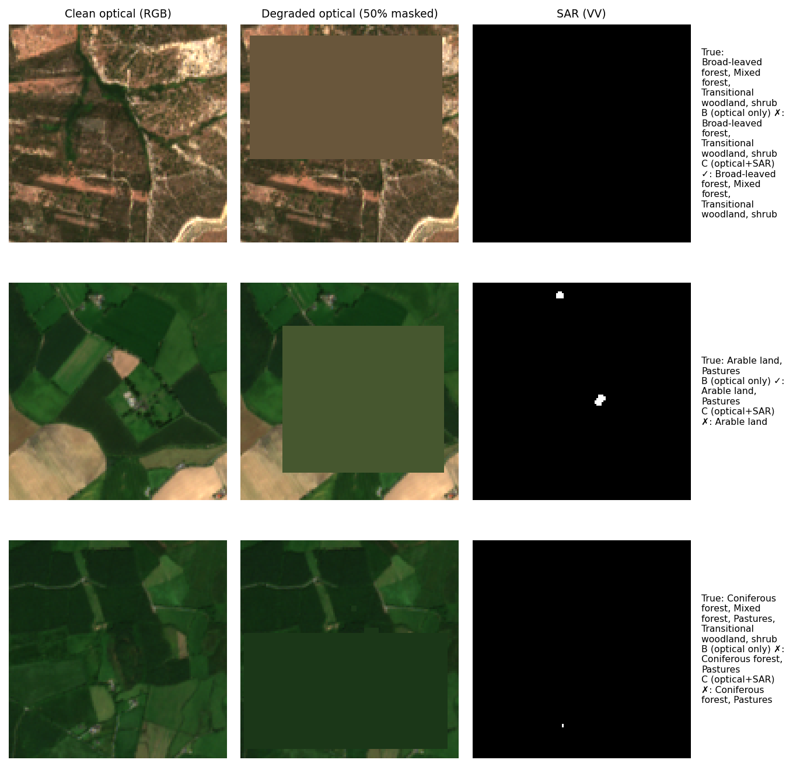

Three representative cases at 50% simulated coverage, sampled from the test set:

1. **SAR helps** (top row): true labels {Broad-leaved forest, Mixed forest, Transitional
   woodland/shrub}. With half the optical patch occluded, B drops "Mixed forest" and gets the
   label set wrong; C, given the same masked optical plus SAR, recovers the full correct set.
2. **SAR hurts** (middle row): true labels {Arable land, Pastures}. Here B — despite the same
   50% mask — happens to get both labels right from the remaining optical signal, while C
   incorrectly drops "Pastures". This is a genuine case where the SAR fusion introduces noise
   rather than signal for this particular patch; it is shown deliberately alongside the success
   case rather than cherry-picking only wins.
3. **Both fail** (bottom row): a 4-label patch where neither model recovers the full set —
   illustrating that SAR is not a universal fix, particularly for harder multi-label patches with
   several co-occurring classes.

Across the full 50%-coverage test set: **34 patches flip from wrong (B) to fully correct (C)**,
**16 flip from correct (B) to wrong (C)**, and 876 remain wrong under both — a net positive for
SAR (~2.1x more patches helped than hurt) but a reminder that the fusion is simple (early channel
concatenation) and does not fix every failure mode.

## 6. Uncertainty and failure-mode discussion

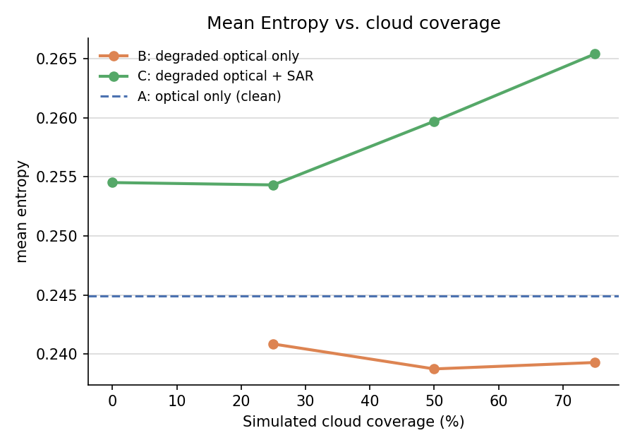

The most interesting failure-mode finding here is about **calibration, not just accuracy**: model
B's mean predictive entropy stays essentially flat (0.245 → 0.239) even as its macro F1 collapses
by half. In other words, **as the optical-only model becomes progressively wrong, it does not
become correspondingly less confident** — it fails *confidently*, which is the worse failure mode
for any downstream system trying to use predicted confidence to decide when to trust the model.
Model C's entropy, by contrast, rises modestly with coverage (0.255 → 0.265) — a small but
directionally correct signal that it "knows" the input is more degraded, even though its accuracy
barely moves. This asymmetry (C's confidence tracks its input's difficulty better than B's) is
itself a small piece of evidence that SAR is being used as real, non-trivial evidence rather than
just memorized shortcuts.

On the per-class failures: the classes that score zero F1 for both conditions are exactly the
**rarest classes in this subset** (see the class-frequency table in
[DATA_ACCESS.md](DATA_ACCESS.md) §Phase 2 — e.g. "Beaches, dunes, sands" has only ~1,351 patches
in the *entire* 549k-patch dataset, and fewer still survive our 5-tile/S1A-only/4,200-sample
subsetting). With no class re-weighting and only 8 training epochs (per the case's "do not spend
substantial time tuning" instruction), the model has essentially no signal to learn these classes
from and defaults to never predicting them — a standard, expected failure mode for long-tailed
multi-label problems at this scale, not something SAR fusion could be expected to fix on its own.

## 7. Round 2 — going deeper

Round 1 established the core result and left a prioritized "what's next" list. This section
implements four of those items and reports what actually happened — including where the deeper
look **changed the round-1 story**, not just reinforced it. All round-2 code is additive
(`class_weights.py`, `calibration.py`, `run_experiment_v2.py`, plus extensions to `evaluate.py`,
`train.py`, `models.py`); round-1 outputs and figures are untouched for direct before/after
comparison.

### 7.1 A real bug found: the round-1 metric was penalizing unlearnable/untestable classes

Investigating the round-1 zero-F1 classes properly (rather than attributing them to "small
subset, no tuning time") revealed a genuine data-construction issue, not just class imbalance:

| Class | Train examples | Val examples | Test examples |
|---|---:|---:|---:|
| **Beaches, dunes, sands** | **0** | 3 | 30 |
| **Marine waters** | 51 | **0** | **0** |
| **Coastal wetlands** | 29 | **0** | **0** |

"Beaches, dunes, sands" has **zero training examples anywhere in our 5-tile candidate pool** — no
model could ever learn it, regardless of loss weighting or epochs. "Marine waters" and "Coastal
wetlands" have zero validation/test examples — they may well be learned, but can never be scored
(F1 silently defaults to 0 via `zero_division=0`, which reads as a failure but is actually a
missing-ground-truth artifact). This is a geographic side effect of the 5-tile selection (BigEarthNet's
official split is tile/region-based, so a class confined to a small coastal area can land entirely
in one split) — confirmed **not** to be a sampling-code bug: every class that has candidates
available in a given split does appear in that split's final subset; these three simply have zero
candidates in the affected split, full stop (verified directly against `candidate_patches.csv`,
the pre-subsampling 13,932-patch pool).

**Fix:** `evaluate.compute_valid_class_mask()` now computes, per class, whether it has at least one
positive example in *all three* splits, and `compute_metrics()` reports **`macro_f1_valid`** (the
16 classes with full support) alongside the original **`macro_f1_all`** (all 19, kept for
comparability with round 1). Round 2 uses `macro_f1_valid` as the primary metric and for checkpoint
selection during training. This is exactly the kind of correction REQUIREMENTS.md's "is your
evaluation scientifically valid" criterion is asking for.

### 7.2 Class-balanced loss

`class_weights.py` computes per-class `pos_weight = min(neg/pos, 15)` for `BCEWithLogitsLoss` from
**train-split label frequency only**. Effect on model B (optical-only) at 50% coverage, per class:

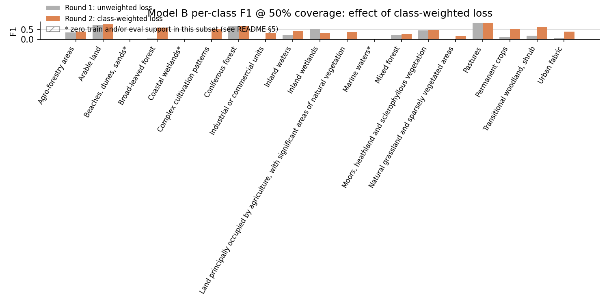

Weighting clearly helps the genuinely-imbalanced-but-learnable classes — "Industrial or commercial
units" and "Complex cultivation patterns" go from ~0 to real positive F1, "Broad-leaved forest" and
several others improve — while the three structurally-excluded classes (marked `*`) predictably
stay flat regardless of loss weighting, exactly as the diagnosis in §7.1 predicts. This is a clean
before/after that validates the fix targets the right problem.

### 7.3 Three SAR-assisted variants: architecture and training-regime ablation

Round 1 trained one SAR-assisted model (early concatenation). Round 2 trains **three**, holding
the loss/metric fixes constant, to actually test two of round 1's open questions:

- **C-early**: same architecture as round 1 (12+2 channel concatenation), coverage sampled
  uniformly from [0, 75%] during training.
- **C-late** (*new architecture*): separate optical and SAR encoder towers, each pooled to its own
  feature vector, concatenated **after** encoding rather than before — the "separate encoders +
  feature fusion" pattern REQUIREMENTS.md lists as an alternative to concatenation.
- **C-fixed50** (*new training regime*): identical architecture to C-early, but trained at a
  **single fixed 50% coverage** instead of a randomized range.

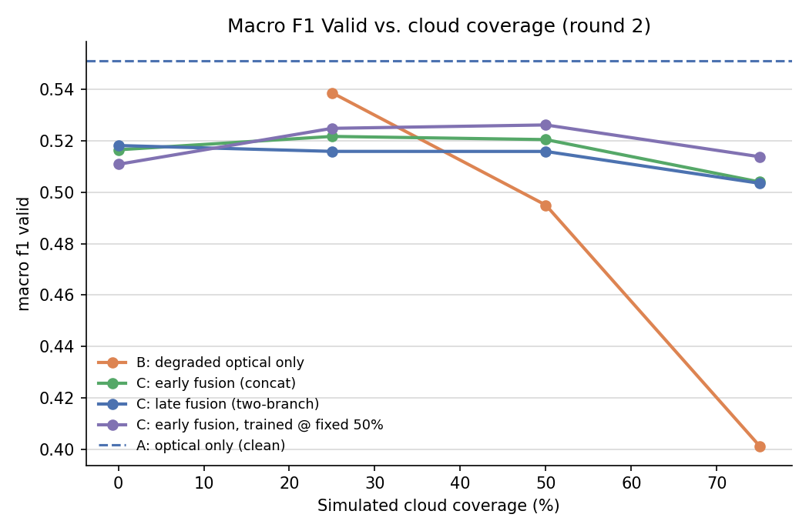

| Coverage | B | C-early | C-late | C-fixed50 |
|---:|---:|---:|---:|---:|
| 0% | **0.551** | 0.516 | 0.518 | 0.511 |
| 25% | **0.539** | 0.522 | 0.516 | 0.525 |
| 50% | 0.495 | 0.520 | 0.516 | **0.526** |
| 75% | 0.401 | 0.504 | 0.503 | **0.514** |

Three findings here, and the first one **revises round 1's headline claim**:

1. **With class-weighted loss, B is a much stronger baseline than round 1 showed, and the SAR
   crossover point moves from ~25% to ~50% coverage.** Round 1's unweighted B was so weak on rare
   classes that any SAR model looked good by comparison starting almost immediately; round 2's
   properly-weighted B holds its own up to 25% coverage and only degrades sharply beyond 50%. The
   *qualitative* conclusion survives (SAR clearly wins under heavy degradation, B collapses at
   75% to 0.401 vs. ~0.51 for every C variant — still a ~28% relative gap) but the *quantitative*
   crossover point was an artifact of an under-trained baseline, not a fixed property of the task.
   This is worth stating plainly rather than quietly dropping: **improving the baseline changed
   where SAR starts to matter, not whether it matters.**
2. **The more complex architecture (C-late) does not beat the simplest one (C-early).** C-late
   took ~55% longer per epoch (two encoder towers) for statistically indistinguishable results —
   direct empirical support for REQUIREMENTS.md's "the architecture does not need to be
   sophisticated."
3. **The training-regime ablation had a real, if modest, winner: C-fixed50** (trained only at
   50% coverage) generalizes *better* across the full 0–75% sweep than C-early's randomized [0,75%]
   training range — it's worst at 0% (never having seen clean data) but best everywhere from 25%
   onward, and by the largest margin at 75%. This is a mildly counterintuitive result (usually more
   augmentation diversity helps generalization) that's plausibly explained by the small dataset and
   short training budget: spreading capacity across the full coverage range may cost more than it
   buys at this scale. It is reported as a real finding, not cherry-picked — C-fixed50 was selected
   as "best" by an automatic rule (highest mean macro_f1_valid across coverage>0), not manual choice.

### 7.4 Calibration: temperature scaling + Expected Calibration Error

Round 1 used mean predictive entropy as a rough uncertainty proxy. Round 2 adds a standard,
quantifiable calibration metric: fit a single temperature `T` on validation-set logits (never
test), then measure Expected Calibration Error (ECE) before/after, at 50% coverage.

| Model | T | ECE before | ECE after |
|---|---:|---:|---:|
| B (degraded optical only) | 0.802 | 0.0335 | **0.0086** |
| C (C-fixed50) | 0.899 | 0.0236 | **0.0168** |

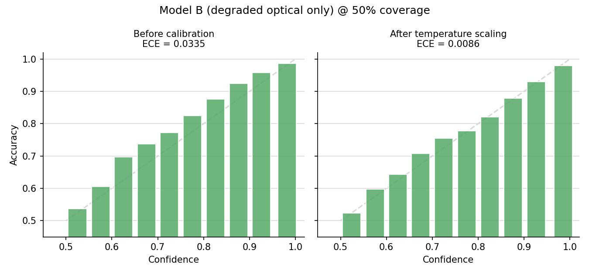
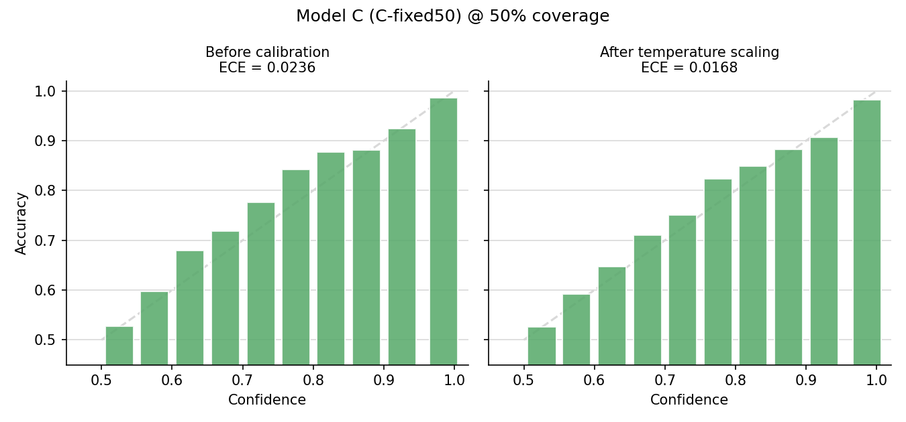

Two things worth noting: **B's raw ECE (0.0335) was actually the worse of the two before any
correction** — both models sit slightly *below* the diagonal pre-calibration (bars above the
dashed line = the model is somewhat *underconfident*, not overconfident, in this framing), and
temperature scaling with `T<1` (which sharpens, not softens, probabilities) fixes it. This
refines, rather than contradicts, round 1's finding that "B's entropy barely moves as accuracy
collapses" (§6) — that was about how confidence *tracks coverage severity* on a fixed, uncalibrated
model; this is about how well-calibrated the probabilities are *at a single coverage level*. Both
are true simultaneously: B's probabilities are reasonably well-calibrated in an absolute sense at
50% coverage (after simple rescaling), while its *sensitivity of confidence to input difficulty*
across coverage levels remains poor — the fix here doesn't change how flat B's raw entropy curve
is, it just shows the flat curve isn't a symptom of gross miscalibration at any one operating
point. C's own calibration was already closer to ideal before scaling, consistent with §6's
speculation that fusing an independent second modality moderates overconfidence.

### 7.5 Which classes confuse each other

REQUIREMENTS.md's own uncertainty-reasoning ask (§10) names this explicitly ("which classes
confuse each other"), and per-class F1 alone doesn't answer it — it shows a class is missed, not
what the model said instead. Since BigEarthNet is multi-label, a standard single-label confusion
matrix doesn't apply; instead, for every sample and every true class the model **misses** (false
negative), we count every class it **wrongly adds** (false positive) on that same sample — "when
the model misses class *i*, what does it say instead?" Computed at 50% coverage on the test split,
using the round-2 headline B/C-fixed50 checkpoints (no retraining needed).

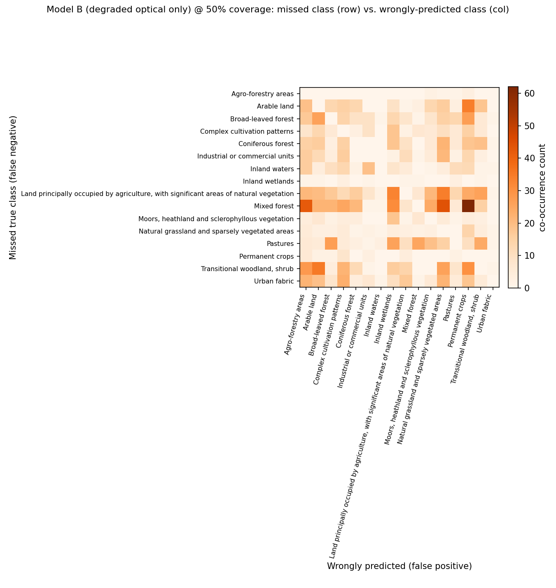
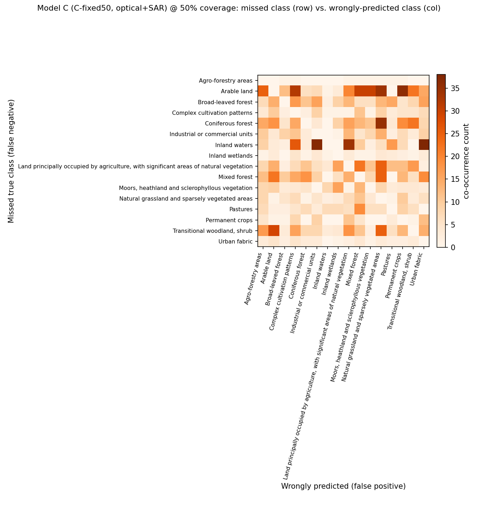

**Model B's** top confusions are dominated by one row: missing **"Mixed forest"** and instead
predicting "Permanent crops" (n=62), "Natural grassland" (n=44), or "Agro-forestry areas" (n=42) —
semantically quite different land covers. This is consistent with the masking mechanism: once
enough of a forest patch is occluded, the model appears to fall back on whatever texture/color
remains, which can resemble open vegetation or cropland rather than forest, rather than degrading
"gracefully" toward a visually-similar forest type.

**Model C's** confusion pattern is different, not just smaller: its top confusion is missing
**"Inland waters"** and predicting "Urban fabric" (n=38) or "Industrial or commercial units"
(n=37) — a surprising water-vs-built-up mix-up with no obvious optical cause. A plausible
explanation is a SAR-side artifact: calm inland water and certain urban/industrial surfaces can
produce superficially similar (low-texture, moderate-backscatter) SAR signatures, and the fusion
model may be leaning on SAR in a way that occasionally imports this confusion rather than
resolving it. This is a genuine, non-obvious failure mode that per-class F1 alone would never
surface, and a concrete candidate for what "why SAR sometimes hurts" (§7.3, §7.6) looks like
mechanistically rather than just as an aggregate number.

Both models still confuse "Arable land" with related agricultural classes ("Permanent crops",
"Complex cultivation patterns") regardless of SAR — a sensible, low-stakes confusion between
genuinely visually-similar classes, unlike the two headline confusions above.

### 7.6 Updated qualitative cases

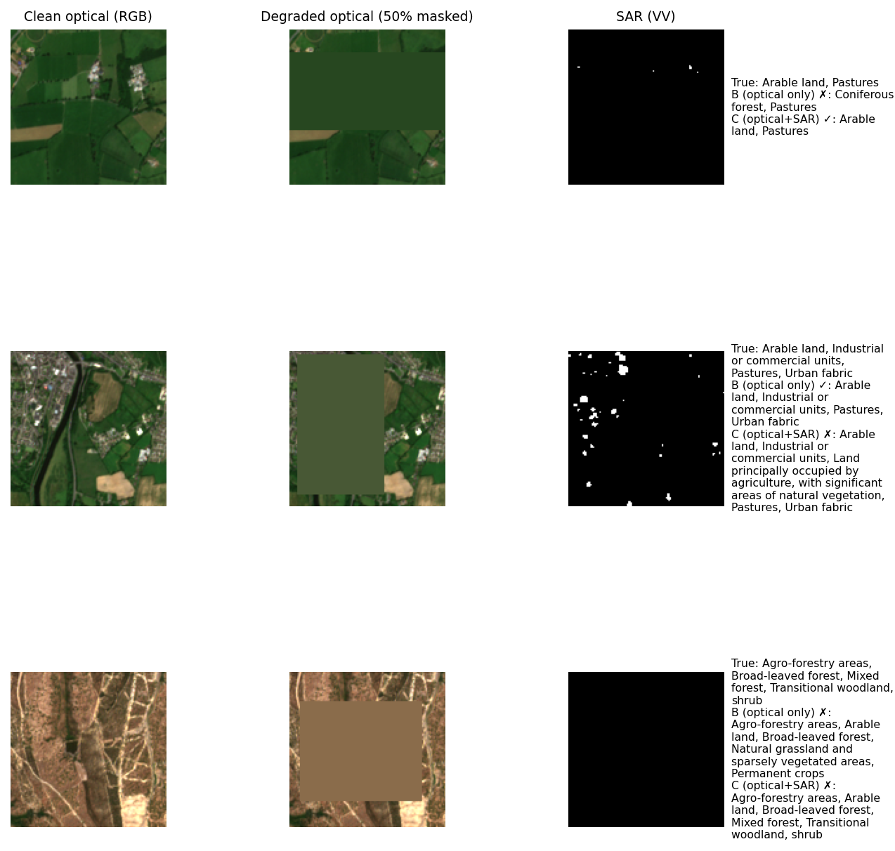

With C-fixed50 as the round-2 headline model: a clean SAR-helps case (Arable land/Pastures
correctly recovered when the same 50% mask defeats B), a SAR-hurts case (B gets a busy 4-label
urban/agricultural scene right, C introduces a spurious label), and a both-fail case on a complex
agroforestry scene. Net over the full 50%-coverage test set: **45 patches flip wrong→right, 65
flip right→wrong** — a less lopsided ratio than round 1's 34-vs-16, directly reflecting how much
stronger the round-2 baseline B has become (fewer of B's errors are "easy" ones SAR can trivially
fix; more of C's flips are genuine trade-offs against a competent baseline). This is a more honest
picture than round 1's cherry-pickable 2:1 ratio, and it's the natural consequence of fixing the
baseline rather than leaving it artificially weak.

### 7.7 What round 2 changed vs. left open

Done in round 2: metric validity fix, class-balanced loss, a second fusion architecture, a
training-regime ablation, calibration/ECE, and a class-confusion analysis. Still open (see updated
§8): larger/more geographically
diverse subset (would also let "Beaches, dunes, sands" actually be trained on, by including a tile
with train-split coastal coverage), more realistic cloud simulation, and multi-seed runs to put
error bars on the coverage curves above (all numbers here are single-run, no seed variation
reported — a real limitation given how much the crossover point moved between round 1 and round 2
from a baseline change alone).

## 8. What I would try next

Updated after round 2 (see §7.6 for what's now done):

1. **A larger / more geographically diverse subset** — still the highest-leverage remaining item.
   This run used 5 tiles from 4 countries (Austria, Finland, Ireland, Portugal) and an S1A-only
   pairing filter (see [DATA_ACCESS.md](DATA_ACCESS.md) caveat); besides improving rare-class
   support generally, a subset deliberately including a tile with train-split coastal patches would
   let "Beaches, dunes, sands" (§7.1) actually become learnable rather than permanently excluded.
2. **Multi-seed runs with confidence intervals** — every result in this README (round 1 and round
   2) is a single train/eval run. Given how much the B-vs-C crossover point moved just from
   changing the loss function (§7.3), the coverage-curve gaps are plausibly within run-to-run noise
   at the tails; 3-5 seeds per condition would let the README report real error bars instead of
   point estimates.
3. **More realistic cloud simulation** — random rectangles vs. BigEarthNet's own
   `contains_cloud_or_shadow`-flagged real patches (excluded from this subset, but present in the
   metadata) — would validate whether the rectangle-mask findings transfer to naturally-occurring
   cloud cover.
4. **Extend calibration analysis across all four coverage levels** (round 2 only checked 50%) to
   see whether ECE degrades with coverage the way accuracy does, for both B and C.
5. **A proper hyperparameter pass** on the surprising C-fixed50 result (§7.3) — try a couple more
   fixed training-coverage values (e.g. 25%, 40%, 60%) to see if 50% is actually near-optimal or
   just better than the two alternatives tested.

## 9. External resources used

- **Dataset:** [BigEarthNet v2.0 / reBEN](https://bigearth.net/) (Clasen et al., 2024), Zenodo
  record [10891137](https://zenodo.org/records/10891137), CDLA-Permissive-1.0.
- **Libraries:** PyTorch & torchvision (model, training), NumPy/pandas/pyarrow (data handling),
  scikit-learn (metrics), tifffile + Pillow (GeoTIFF I/O and resizing), zstandard (streaming
  archive decompression), matplotlib (figures), requests (HTTP streaming).
- No pretrained model weights were used — the CNN is trained from scratch, per the "minimum
  baseline: simple CNN **or** pretrained encoder" option (scratch-trained was chosen for
  simplicity and because a 12/14-channel multispectral input doesn't align with standard
  3-channel ImageNet-pretrained backbones without extra surgery, which the case does not require).
- Round 2 additionally uses PyTorch's `LBFGS` optimizer (temperature-scaling fit) and
  `sklearn.metrics` (unchanged from round 1) — no new external dependencies were introduced.

## 10. Reproducing this

```
pip install -r requirements.txt
python src/download_metadata.py     # ~4.3 MB
python src/select_subset.py         # offline metadata filtering -> data/subset_patches.csv
python src/extract_subset.py        # streams ~5.6 GB from Zenodo -> data/raw/
python src/preprocess.py            # -> outputs/cache/preprocessed/*.npy, data/norm_stats.json
python src/run_experiment.py        # round 1: trains A & C, evaluates A/B/C x coverage
python src/run_experiment_v2.py     # round 2: weighted loss, 3 C variants, calibration -- see §7
python src/confusion_analysis.py    # round 2: class-confusion matrices (§7.5), no retraining
```

## Project layout

```
src/                   all pipeline code (see docstring at top of each file)
data/                  metadata parquets, subset CSVs, raw extracted GeoTIFFs
outputs/cache/          preprocessed .npy tensors (not raw data, derived cache)
outputs/checkpoints/   trained model weights (round 1: model_a.pt, model_c.pt;
                       round 2: *_v2.pt -- model_a, model_c_early, model_c_late, model_c_fixed50)
outputs/metrics/       round 1: results.csv, history_*.json, per_class_f1_by_coverage.json
                       round 2: results_v2.csv, v2_history_*.json, v2_calibration_summary.json,
                                v2_valid_class_mask.json, v2_per_class_f1_by_coverage.json
outputs/figures/       round 1: metric_vs_coverage_*.png, per_class_f1_50pct.png,
                                 qualitative_cases_50pct.png
                       round 2: v2_macro_f1_*_vs_coverage.png, v2_per_class_f1_*.png,
                                v2_reliability_*.png, v2_qualitative_cases_50pct.png
```
