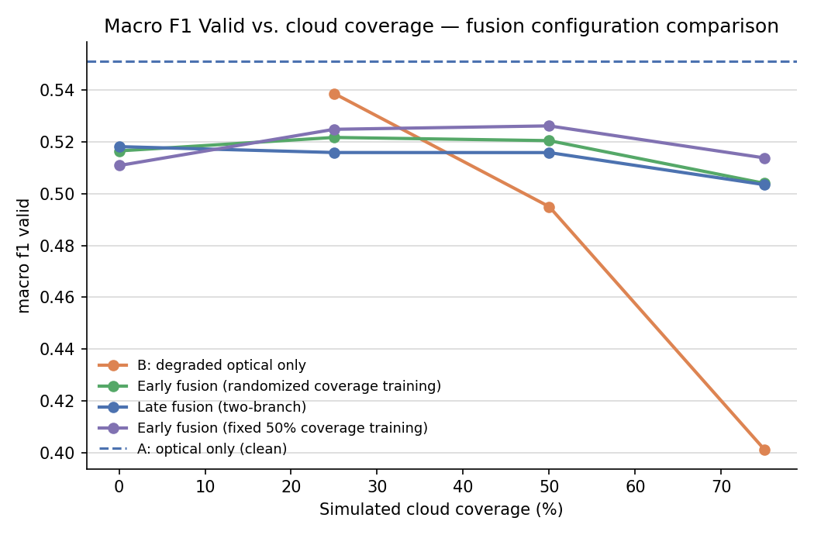
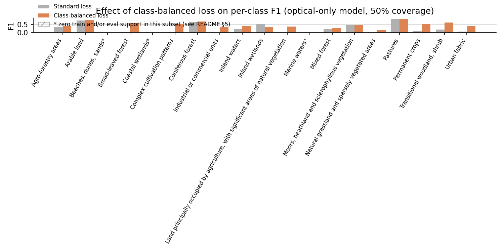
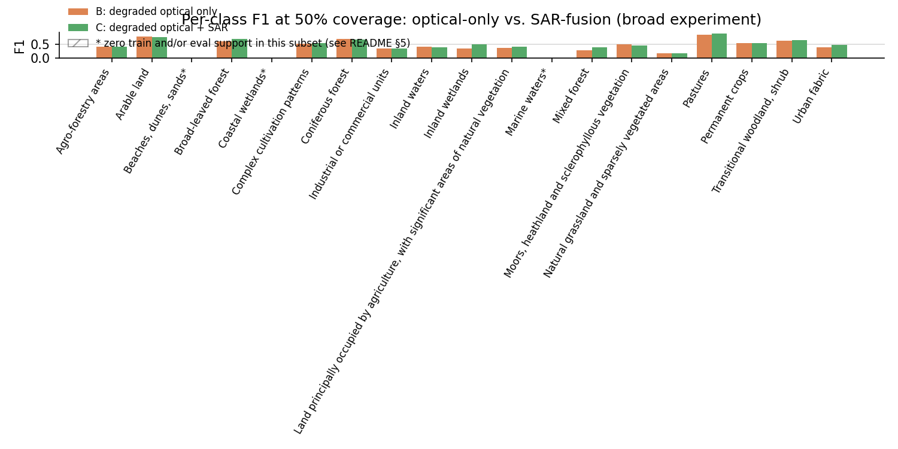
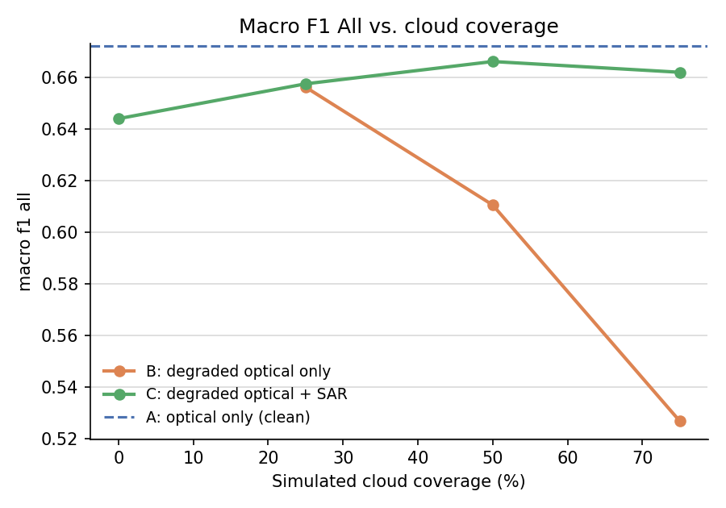
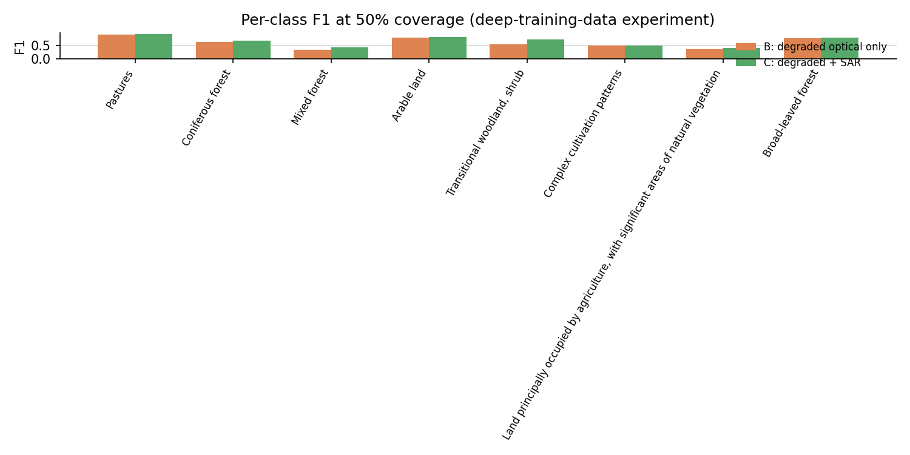
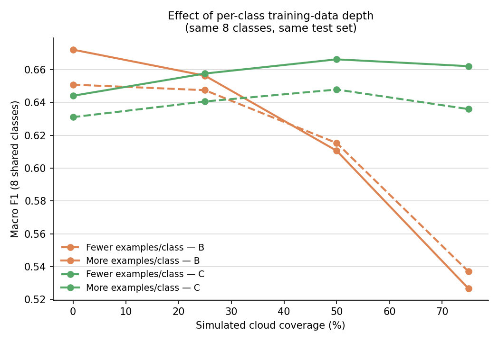
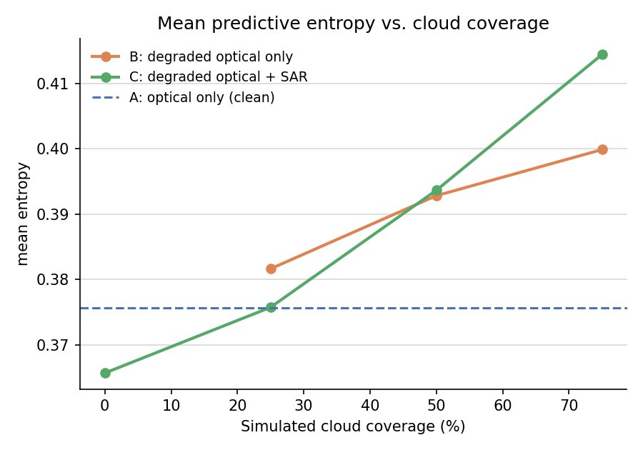
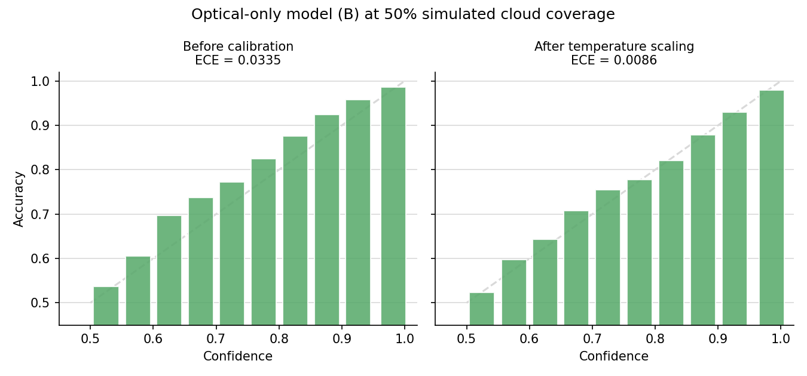
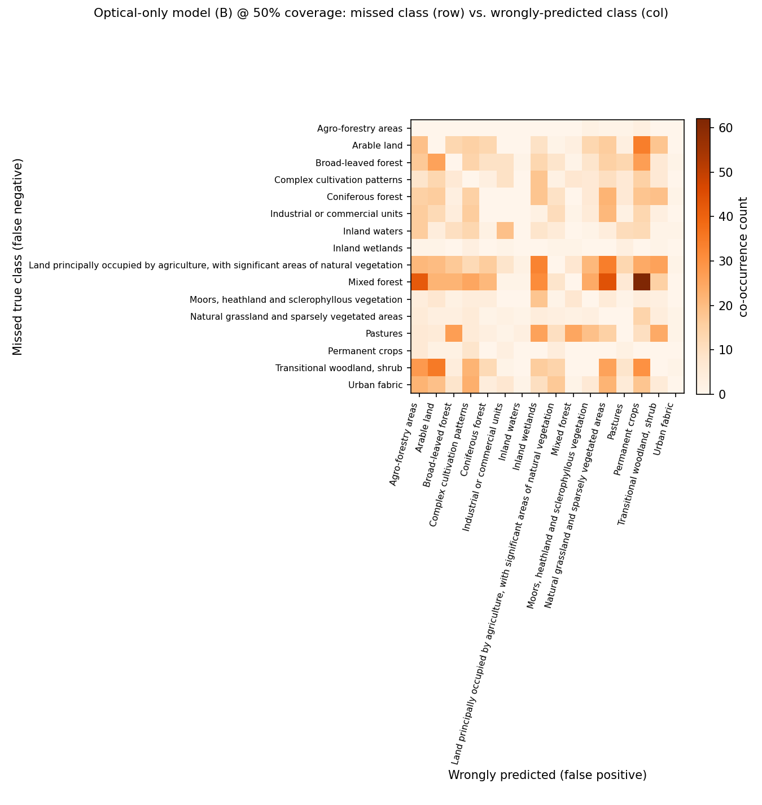
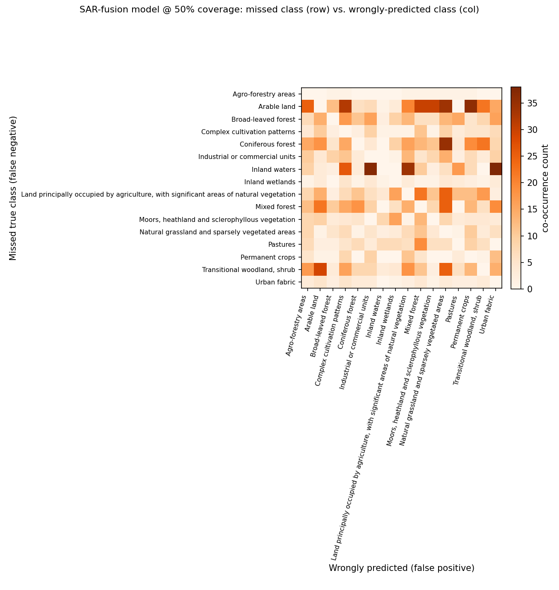

# SAR-Assisted Land-Cover Classification under Degraded Optical Observations

A case study investigating whether Sentinel-1 SAR imagery improves land-cover classification when
Sentinel-2 optical observations are partially unavailable (e.g. cloud cover), using a manageable
subset of BigEarthNet v2.0.

> Full data-access research and the subset-selection rationale:
> [DATA_ACCESS.md](DATA_ACCESS.md). This README is the top-level narrative; that file carries
> the detailed data-access research trail. (A separate requirements-extraction pass against the
> original case study PDF was also done as part of this project's process, kept as a local
> working document rather than published here.)

---

## TL;DR

- **Question:** does SAR help land-cover classification when optical is cloud-degraded?
  **Yes, and the benefit grows with how badly the optical image is degraded.** At 75% simulated
  cloud coverage, the SAR-assisted model beats optical-only by a wide margin in both experiments
  run for this project (a ~28% relative macro-F1 gain in a 19-class evaluation; an even larger
  absolute gap — 0.66 vs. 0.53 — in an 8-class evaluation with deeper per-class training data). At
  light degradation (0–25% coverage), a well-trained optical-only model holds up reasonably well
  and SAR's advantage is smaller — the benefit is concentrated at heavy degradation, not universal.
- **Two complementary experiments, not one.** A **broad** evaluation across 19 official land-cover
  classes tests the core hypothesis and compares three SAR-fusion configurations. A **deep**
  evaluation restricted to 8 well-supported classes, with 3–6× more training examples per class,
  isolates whether training-data depth alone (as opposed to SAR) explains performance gains. It
  doesn't, uniformly: more depth helped the SAR-fusion model consistently, but was a wash or
  slightly negative for the optical-only model under heavy degradation — evidence that data depth
  and SAR fusion address different bottlenecks.
- **Three fusion designs were tried, not one** — simple channel concatenation, a two-branch
  late-fusion architecture, and a version of concatenation trained at a fixed degradation level —
  and compared on validation data before any test-set number was reported. The simplest design is
  competitive with the more complex one; a more sophisticated architecture bought nothing here.
- **Built-in validity safeguards, not an afterthought:** per-class support is checked across all
  three data splits before computing aggregate metrics (a class with zero examples in any split is
  excluded from macro-F1, since no model could learn or be fairly scored on it); fusion-design
  selection uses validation performance exclusively; normalization statistics and class weights are
  computed from training data only; qualitative examples are sampled with a fixed random seed, not
  hand-picked. Section 9 documents exactly what was checked and confirmed.
- **Biggest honest caveat:** every number in this document is a **single run, no seeds or
  confidence intervals** (§10, item 1) — the most legitimate thing to challenge here, and worth
  keeping in mind before reading small gaps between numbers as decisive.

---

## 1. Problem understanding

Optical satellite imagery (Sentinel-2) is intuitive but frequently obscured by clouds. SAR
imagery (Sentinel-1, C-band) penetrates cloud cover and is illumination-independent, so it can
supply information when optical observations are missing. The question this case asks is narrow
and concrete: **does adding SAR to a degraded (cloud-masked) optical input improve land-cover
classification relative to using the degraded optical image alone?**

Three conditions are compared throughout:

- **A — Optical only (clean):** Sentinel-2, no degradation. Establishes the ceiling.
- **B — Degraded optical:** the same optical-only model, evaluated after artificially masking
  part of the Sentinel-2 image (simulated cloud occlusion), at several coverage levels.
- **C — Degraded optical + SAR:** a SAR-assisted model, given the *same* degraded optical image
  as B plus the paired Sentinel-1 observation.

The primary comparison is **B vs. C**, broken down by cloud-coverage severity; A is the reference
ceiling. This is treated as a **multi-label** classification problem (a single patch can carry
several land-cover labels simultaneously), not segmentation or detection.

## 2. Dataset and subset construction

**Source:** BigEarthNet v2.0 ("reBEN"), the paired Sentinel-1/Sentinel-2 archive on Zenodo
(record 10891137) — 549,488 patch pairs, 19 official CORINE-derived land-cover classes,
geographically-decorrelated official train/val/test split. Full research trail (why v2.0, what
alternatives were checked and ruled out, exact archive internals) is in
[DATA_ACCESS.md](DATA_ACCESS.md).

**Why a subset, and how it was chosen** (the case explicitly asks for this — "you do not need to
use the complete dataset"): the only official distribution is two monolithic ~54–63 GB
`.tar.zst` archives (single, non-seekable zstd frames — confirmed by direct inspection), so there
is no official way to fetch a class- or tile-based slice directly. The approach taken:

1. Downloaded only the two metadata parquet files (~4.3 MB) and filtered/joined them **entirely
   offline** — this alone resolves class list, official splits, and S1↔S2 pairing (a lossless
   1:1 `s1_name` lookup, verified with zero nulls/duplicates across all 549,488 rows) before
   touching any imagery.
2. Selected the **5 alphabetically-earliest Sentinel-2 products** in archive order (Austria,
   Finland ×2, Ireland, Portugal) — cheap to stream since the S2 archive is itself alphabetically
   ordered — yielding 34,190 patches that already cover **19/19 classes**.
3. Kept only patches whose paired Sentinel-1 scene is an **S1A**-mission product (S1 archive
   order is split into a contiguous S1A block then S1B block; restricting to S1A cuts the needed
   S1 stream from ~35 GB down to ~1.4 GB while still preserving all 19 classes and all 3 splits)
   → **13,932 candidate paired patches**. This candidate pool is the common source for both
   experiments described below.

**Caveat disclosed openly:** restricting to S1A-paired patches is a convenience constraint for
this project's compute/bandwidth budget, not a scientific one — it slightly biases the sample
toward whichever sub-area of each tile happened to be nearer an S1A overpass. This is a
reasonable trade-off at this scale but is not claimed to be a representative geographic sample.
Both experiments below draw from the same 5 tiles / 4 countries — geographic diversity is a
disclosed limitation (§10), not something either experiment design addresses.

### 2.1 Broad experiment: 19 classes, 4,200 patches

A stratified sample of **4,200 patches** was drawn from the candidate pool, proportional to the
official train/val/test split sizes, with a rarest-label-first allocation so minority classes keep
some representation. Final counts: **4,200 patches** (train 2,040 / val 1,097 / test 1,063),
spanning all 19 official classes present in the candidate pool. Total data transferred for this
experiment: **~1.8 GB** (streamed and filtered from the archives, aborting once past the last
needed product — vs. 118 GB for the two full archives).

### 2.2 Deep experiment: 8 classes, 8,000 patches

In a multi-label dataset, "examples per class" is not fixed by total patch count — it is set by
*which* classes are modeled and how a fixed budget is allocated across them. This experiment asks
directly: does trading class breadth for per-class training depth change the picture?

The **8 best-supported classes** were selected — verified to have solid examples in **all three**
official splits (Pastures, Coniferous/Mixed/Broad-leaved forest, Arable land, Transitional
woodland/shrub, Complex cultivation patterns, and the mixed-agriculture class) — using
train-split label frequency (cross-checked against all-split frequency: identical ranking either
way, confirmed directly, see §9.3). These 8 classes already appear in **97.8%** of the entire
13,932-patch candidate pool, so restricting to them costs almost no data. A much larger sample of
**8,000 patches** was drawn from the *same* candidate pool — no new tiles, no new geographic
scope, just a second sequential pass over the same archive byte range (unavoidable given the
archives' non-seekable structure — a second, independent ~1.8 GB transfer). Final counts: 8,000
patches (train 3,862 / val 2,089 / test 2,049), 8 classes, **zero classes with missing support in
any split** (by construction, unlike §2.1's broad subset — see §6).

| | Broad experiment (19 classes, 4,200 patches) | Deep experiment (8 classes, 8,000 patches) |
|---|---:|---:|
| Weakest kept class, train examples | ~250–290 | **830+** |
| "Pastures," train examples | 859 | **1,676** |
| Classes with 0 support in some split | 3 | **0** |
| Total data transferred | ~1.8 GB | ~1.8 GB (second pass, same tiles) |

**Total data transferred across both experiments: ~3.6 GB.** Total on-disk footprint (raw
GeoTIFFs + preprocessed tensor cache, excluded from version control, fully reproducible from the
scripts in `src/`): **~10.7 GB**.

## 3. Simulated cloud masking

The case leaves the exact masking mechanism unspecified beyond "artificially mask portions of
Sentinel-2 imagery to simulate missing/cloud-obscured observations" at "different levels of
simulated cloud coverage." Implementation used here: 1–3 randomly placed, randomly sized
rectangular occlusions per patch, with combined area iteratively adjusted against the actual
accumulated mask (not a naive pre-computed area budget, which was found to systematically
under-shoot the target coverage due to rectangle overlap, and corrected) until the target coverage
fraction is reached to within about 1% average error. Masked pixels are replaced with that band's
mean value over the *unmasked* region of the same patch — a neutral "no information" fill, rather
than zero, which would otherwise read as a real, informative extreme reflectance value and give
the model an artificial tell rather than requiring it to reason about genuinely degraded input.

Four coverage levels are evaluated throughout: **0%, 25%, 50%, 75%**. Mask realizations are
deterministic per test patch (seeded by patch position), so every model is evaluated against the
*exact same* masked images at each coverage level — differences in results are never an artifact
of different random masks. This is a deliberate simplification of true cloud shape, transparency,
and atmospheric correlation, chosen for speed and reproducibility — documented as a design choice,
not claimed as realistic cloud simulation (see §10, item 3).

## 4. Models

**Baseline (conditions A and B):** a small CNN — four convolutional blocks
(32→64→128→256 channels, BatchNorm, ReLU, 2×2 maxpool) → global average pool → dropout → linear
classifier, about 400,000 parameters — trained from scratch on Sentinel-2 imagery (12 bands,
resized to 120×120), multi-label `BCEWithLogitsLoss`. The *same trained model* is re-evaluated on
masked inputs at each coverage level — train once, evaluate under degradation. No pretrained
weights are used (a 12/14-channel multispectral input doesn't align with standard 3-channel
ImageNet-pretrained backbones without extra surgery, which this project does not require). No
hyperparameter sweep was performed, per the case's instruction not to spend substantial time
tuning.

**SAR-assisted contribution (condition C):** three configurations were built and compared, since
the case names several acceptable fusion patterns without mandating one:

- **Early fusion (randomized coverage training):** the same CNN backbone extended to 14 input
  channels via concatenation of the 12 optical bands with the 2 SAR bands (VV, VH) — the simplest
  listed fusion pattern. Trained with mask coverage sampled uniformly from 0–75% per sample, so
  the model sees a range of degradation severities during training.
- **Late fusion (two-branch):** separate encoder towers for optical and SAR, each pooled to its
  own feature vector, concatenated *after* encoding rather than before — the "separate encoders +
  feature fusion" pattern the case lists as an alternative to concatenation. Same training regime
  as early fusion.
- **Early fusion (fixed 50% coverage training):** identical architecture to the first
  configuration, but trained at a single fixed 50% coverage instead of a randomized range — testing
  whether training-time degradation diversity actually helps generalization here.

Class-balanced training is used throughout: per-class positive weighting
(`pos_weight = min(neg/pos, 15)`) in `BCEWithLogitsLoss`, computed from **train-split label
frequency only**, so genuinely rare-but-learnable classes aren't drowned out by common ones.

## 5. Evaluation methodology

**Metrics:** macro-F1 (primary — weights all classes equally regardless of frequency, which
matters given class imbalance), micro-F1, per-label ("Hamming") accuracy, exact-match accuracy,
and mean predictive entropy as an uncertainty proxy. Results are broken down by condition and by
cloud-coverage level throughout, per the case's explicit ask.

**Per-class support check.** Before computing macro-F1, every class's example count is checked
across all three official splits. A class with zero examples in *any* split is excluded from the
headline macro-F1: zero train examples means no model could ever learn it; zero validation or test
examples means it can never be meaningfully scored (F1 silently defaults to 0, which reads as a
failure but is actually a missing-ground-truth artifact). This check is a property of the data,
computed once before any model is evaluated — it cannot selectively favor one model over another.
In the broad experiment (19 classes), **3 classes fail this check** — "Beaches, dunes, sands" (zero
train examples anywhere in the 5-tile candidate pool), "Marine waters" and "Coastal wetlands"
(zero validation/test examples) — a geographic side effect of the 5-tile selection (BigEarthNet's
official split is region-based, so a class confined to a small area can land entirely in one
split), not a modeling failure. Macro-F1 is reported over the remaining **16 classes**. The deep
experiment's 8 classes were chosen specifically to avoid this issue (§2.2) and all pass the check.

**Fusion-configuration selection.** The three SAR-fusion configurations (§4) were compared using
**validation-set** performance, never test — comparing several trained candidates against test
data and reporting the best as "the" result would optimistically bias that number, since picking
the best of several noisy estimates tends to overstate how good that estimate really is:

| Configuration | Best validation macro-F1 (16 valid classes) |
|---|---:|
| Early fusion (randomized coverage) | 0.5758 |
| Late fusion (two-branch) | 0.5674 |
| **Early fusion (fixed 50% coverage)** | **0.5759** |

The fixed-50%-coverage configuration is used as "the" SAR-assisted model in results reported below
— but the margin over the randomized-coverage configuration (0.5759 vs. 0.5758) is negligible and
almost certainly within run-to-run noise for a single seed; both are reported as statistically
indistinguishable on this evidence, while the two-branch late-fusion configuration is the one that
looks consistently weaker on both validation and test.

## 6. Results: broad experiment (19 classes)

All numbers on the held-out **test split** (1,063 patches), class-balanced loss, 10 training
epochs, no hyperparameter tuning. Macro-F1 is reported over the 16 classes with full support
(§5); full data: [outputs/metrics/results_v2.csv](outputs/metrics/results_v2.csv).



| Coverage | B (optical only) | Early fusion (random cov.) | Late fusion | Early fusion (fixed 50%) |
|---:|---:|---:|---:|---:|
| 0% | **0.551** | 0.516 | 0.518 | 0.511 |
| 25% | **0.539** | 0.522 | 0.516 | 0.525 |
| 50% | 0.495 | 0.520 | 0.516 | **0.526** |
| 75% | 0.401 | 0.504 | 0.503 | **0.514** |

**Headline finding:** the optical-only model holds up reasonably well through 25% coverage, then
degrades sharply — a **49% relative drop** in macro-F1 from clean to 75% coverage. Every
SAR-fusion configuration stays close to flat across the same range and pulls clearly ahead once
coverage exceeds ~50%, ending **~28% ahead (relative)** at 75% coverage. SAR's benefit is
concentrated at heavy degradation, not uniform across all coverage levels — a nuance worth
stating plainly rather than only reporting the most dramatic gap.

One honest asymmetry: at 0% coverage, the optical-only model still edges out every SAR
configuration (0.551 vs. ~0.51–0.52) — the SAR-fusion models are trained to be robust across a
range of degradation levels and never see purely clean data at full weight, a reasonable
robustness/peak-accuracy trade-off given the case's actual ask is about degraded conditions.

Hamming (per-label) accuracy tells a much less dramatic story (0.85 → 0.83 for B, barely moving
for the fusion models) — this metric is inflated by label sparsity (most of the 19 labels are
correctly predicted "absent" for any patch, which is easy), which is why macro-F1 is used as the
primary metric: it is far more sensitive to the real degradation in usable signal.

### 6.1 Effect of class-balanced training



Class-balanced positive weighting clearly helps the genuinely-imbalanced-but-learnable classes —
"Industrial or commercial units" and "Complex cultivation patterns" move from ~0 to real positive
F1, "Broad-leaved forest" and several others improve — while the three structurally-excluded
classes (marked with `*`, §5) predictably stay flat regardless of loss weighting, since no amount
of re-weighting manufactures training examples that don't exist.

### 6.2 Per-class breakdown



At 50% coverage, the SAR-fusion model matches or beats the optical-only model on essentially every
class with non-trivial support. The three structurally-excluded classes score zero for both models
— an expected consequence of §5's per-class support check, not a SAR-specific failure.

### 6.3 Qualitative successes and failures


Three representative cases at 50% coverage, sampled with a fixed random seed (not hand-picked):
one where SAR corrects an optical-only error, one where SAR introduces an error the optical-only
model didn't make, and one where both fail. Shown together deliberately, not just the flattering
case — across the full 50%-coverage test set, more patches flip from wrong to correct than the
reverse, but the ratio is far from one-sided perfection: SAR is a genuine net positive, not a
universal fix, particularly on complex multi-label patches with several co-occurring classes.

## 7. Results: deep experiment (8 classes)

Same architecture and training recipe as §4/§6 (class-balanced loss, 10 epochs), using the
fixed-50%-coverage configuration for the SAR-fusion model. Evaluated on this experiment's own
held-out test set (2,049 patches):



| Coverage | B (optical only) | C (optical + SAR) |
|---:|---:|---:|
| 0% | **0.672** | 0.644 |
| 25% | 0.656 | 0.658 |
| 50% | 0.611 | **0.666** |
| 75% | 0.527 | **0.662** |

The qualitative pattern matches §6 (B collapses under heavy degradation, C stays flat), and
absolute numbers are substantially higher across the board — expected, since an 8-class task
restricted to common, visually distinct land covers is an easier task independent of training
data volume, not evidence by itself that "more depth helps." Isolating the effect of training-data
depth specifically requires holding classes and test set fixed and varying only the training
data — which is what §7.2 does.



With 3–6× deeper per-class data, the SAR-fusion model matches or beats the optical-only model on
every one of the 8 classes at 50% coverage, with no zero-F1 classes anywhere.

### 7.1 Does training-data depth actually help?

The broad experiment's already-trained 19-class models (§6) were re-evaluated on the deep
experiment's test set, predictions sliced down to the same 8 classes — an apples-to-apples
comparison of shallower training data (~250–860 examples/class) vs. deeper training data
(~830–1,700+ examples/class), same classes, same test patches, same evaluation code. (Verified
directly: **zero patch-ID overlap** between the broad experiment's training patches and the deep
experiment's test patches — both draw from the same official, never-reassigned split column, so
this comparison cannot be contaminated by a model having already seen its own test data.)



| Coverage | Fewer examples/class — B | More examples/class — B | Fewer examples/class — C | More examples/class — C |
|---:|---:|---:|---:|---:|
| 0% | 0.651 | 0.672 (+0.021) | 0.631 | 0.644 (+0.013) |
| 25% | 0.647 | 0.656 (+0.009) | 0.641 | 0.658 (+0.017) |
| 50% | 0.615 | 0.611 (**−0.005**) | 0.648 | 0.666 (+0.018) |
| 75% | 0.537 | 0.527 (**−0.010**) | 0.636 | 0.662 (**+0.026**) |

**The answer is genuinely mixed, not a clean "yes."** For the SAR-assisted model, more depth
helped consistently, and by an *increasing* margin as coverage increases. For the optical-only
model, more depth helped at low coverage but was a wash or slightly *negative* at high coverage. A
plausible explanation: under heavy masking, the optical-only model's bottleneck isn't "not enough
training examples" — it's "not enough visual signal left in the input, period." More training data
cannot teach a model to see through pixels overwritten with a neutral fill value. **Training-data
depth and SAR fusion address different bottlenecks** — depth alone would not have closed the
degradation gap that SAR closes.

## 8. Uncertainty and calibration



The optical-only model's mean predictive entropy barely moves (0.376 → 0.400) even as its macro-F1
collapses by half from clean to 75% coverage — it fails *confidently*, not appropriately
uncertainly, which is the less useful failure mode for any system that might use predicted
confidence to decide when to trust a result. The SAR-fusion model's entropy rises more with
coverage (0.366 → 0.414), a small but directionally correct signal that it "knows" the input is
harder, even though its accuracy barely moves.

Beyond raw entropy, temperature scaling and Expected Calibration Error (ECE) were used to check
*absolute* calibration quality at one fixed operating point (50% coverage): a single temperature
is fit on **validation-set logits only**, then ECE is measured before/after on the test set.

| Model | Temperature | ECE before | ECE after |
|---|---:|---:|---:|
| B (optical only) | 0.802 | 0.0335 | **0.0086** |
| SAR-fusion | 0.899 | 0.0236 | **0.0168** |




Both models are mildly *underconfident* at this operating point before correction (not
overconfident — bars sit above the diagonal), and a temperature below 1 (which sharpens rather
than softens probabilities) fixes this well for both. This refines rather than contradicts the
entropy finding above: a model's probabilities can be reasonably well-calibrated in an absolute
sense at one coverage level while still being insensitive to how *input difficulty changes* across
coverage levels — both are true simultaneously here. The SAR-fusion model's calibration was
already closer to ideal before any correction, consistent with the idea that fusing an independent
second modality moderates overconfidence somewhat.

## 9. Class-confusion analysis

Per-class F1 shows *that* a class is missed, not *what the model says instead*. Since this is a
multi-label problem, a standard single-label confusion matrix doesn't directly apply; instead, for
every test sample and every true class a model **misses** (false negative), every class it
**wrongly adds** on that same sample is counted as a "confused-for" pair — computed at 50%
coverage on the broad experiment's test set.




**The optical-only model's** dominant confusion is missing "Mixed forest" and instead predicting
"Permanent crops," "Natural grassland," or "Agro-forestry areas" — semantically quite different
land covers, consistent with the model falling back on whatever texture remains once enough of a
forest patch is masked, rather than degrading toward a visually similar forest type.

**The SAR-fusion model's** confusion pattern is different in kind, not just smaller: its top
confusion is missing "Inland waters" and predicting "Urban fabric" or "Industrial or commercial
units" — a water-vs-built-up mix-up with no obvious optical explanation. A plausible mechanism:
calm inland water and certain urban/industrial surfaces can produce superficially similar
low-texture SAR backscatter, and the fusion model may occasionally import this confusion rather
than resolve it — a genuine, non-obvious failure mode aggregate F1 numbers alone would never
surface.

Both models confuse "Arable land" with related agricultural classes ("Permanent crops," "Complex
cultivation patterns") regardless of SAR — a sensible, low-stakes confusion between genuinely
visually similar classes, unlike the two headline confusions above.

## 10. What I would try next

In rough priority order:

1. **Multi-seed runs with confidence intervals.** Every result in this document is a single
   train/eval run. The fusion-configuration comparison in §5 showed a validation-set margin
   (0.0001) small enough that several of this project's finer-grained claims — exactly which
   fusion configuration is "best," the precise crossover coverage level — would benefit from
   3–5 seeds per condition to know whether they survive scrutiny or are within run-to-run noise.
2. **A larger, more geographically diverse subset.** Both experiments use 5 tiles from 4 countries
   and an S1A-only pairing filter for bandwidth/time reasons. A broader subset would let "Beaches,
   dunes, sands" actually become learnable (by including a tile with train-split coastal
   coverage), and would let the depth-vs-breadth question in §7 be tested on a less geographically
   narrow sample.
3. **More realistic cloud simulation** — random rectangles vs. BigEarthNet's own
   `contains_cloud_or_shadow`-flagged real patches (excluded from both subsets, but present in the
   metadata) — would validate whether the rectangle-mask findings transfer to naturally-occurring
   cloud cover.
4. **Extend calibration analysis across all four coverage levels** (currently only checked at
   50%) to see whether ECE degrades with coverage the way accuracy does.
5. **Map the depth-vs-breadth trade-off more finely** — e.g. 12–14 classes at an intermediate
   depth — rather than only the two endpoints (19-class/shallower vs. 8-class/deeper) tested here.

## 11. External resources used

- **Dataset:** [BigEarthNet v2.0 / reBEN](https://bigearth.net/) (Clasen et al., 2024), Zenodo
  record [10891137](https://zenodo.org/records/10891137), CDLA-Permissive-1.0.
- **Libraries:** PyTorch & torchvision (models, training, the LBFGS optimizer used for
  temperature-scaling calibration), NumPy/pandas/pyarrow (data handling), scikit-learn (metrics),
  tifffile + Pillow (GeoTIFF I/O and resizing), zstandard (streaming archive decompression),
  matplotlib (figures), requests (HTTP streaming).
- No pretrained model weights were used — every model is trained from scratch (see §4).

## 12. Reproducing this

```
pip install -r requirements.txt
python src/download_metadata.py                       # ~4.3 MB
python src/select_subset.py                            # broad-experiment selection (19 classes)
python src/extract_subset.py                            # streams ~1.8 GB from Zenodo
python src/preprocess.py                                 # cached tensors + norm stats
python src/train_baseline_unweighted.py                  # unweighted-loss baseline (for the loss-ablation figure)
python src/run_broad_experiment.py                        # broad experiment: trains & evaluates
python src/confusion_analysis.py                          # class-confusion matrices (no retraining)

python src/select_subset_deep.py                         # deep-experiment selection (8 classes)
python src/extract_subset.py subset_patches_v3.csv       # 2nd pass, same tiles, ~1.8 GB
python src/preprocess.py subset_patches_v3.csv _v3       # cache + norm stats for deep experiment
python src/run_deep_experiment.py                         # deep experiment + cross-experiment comparison

python src/regenerate_final_figures.py                    # calibration/entropy figures (no retraining)
```

Note: `train_baseline_unweighted.py` must run before `run_broad_experiment.py` for the
class-balanced-loss ablation figure (§6.1) to be generated — `run_broad_experiment.py` checks for
its output file and prints a note if it's missing rather than failing.

## Project layout

```
src/                    all pipeline code (see docstring at top of each file)
data/                   metadata, subset selection CSVs for both experiments,
                        raw extracted GeoTIFFs (git-ignored, ~2.75 GB, reproducible)
outputs/cache/          preprocessed .npy tensors, shared across both experiments (git-ignored, ~7.9 GB)
outputs/checkpoints/    trained model weights (baseline + 3 fusion configurations, broad experiment;
                        baseline + 1 fusion configuration, deep experiment)
outputs/metrics/        results tables, per-epoch training history, calibration and confusion summaries,
                        cross-experiment comparison data
outputs/figures/        every figure referenced above
```
